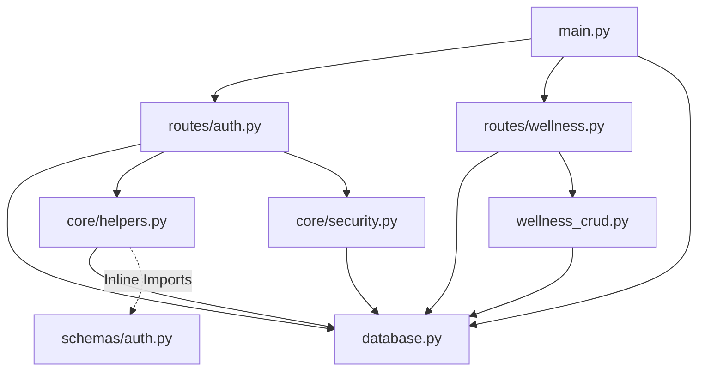

# 🏛️ NeuroLearn AI — Backend Architecture & Project Structure Audit

**Prepared by:** Principal Software Architect, Staff FastAPI Engineer & Backend Tech Lead  
**Date:** July 4, 2026  
**Audit Status:** COMPLETE (Diagnostic Review Only)

---

## 📋 Executive Summary
This document presents a comprehensive, production-oriented Backend Architecture and Project Structure Audit of the **NeuroLearn AI** system. The platform consists of a FastAPI backend interacting with a PostgreSQL database (hosted on Supabase) alongside AI modular layers and React-based frontend portals. 

The backend has recently undergone a partial transition from a single monolithic file to a modular router-based structure. However, the system still exhibits significant architectural concerns, including **leaky database session management**, **concurrency hazards due to runtime startup schema migrations**, **exposed secrets**, **business logic mixed directly inside routers**, and **lack of database abstraction layers (Repositories/DAOs)**.

This report serves as a detailed guide to help transition the codebase to a stable, maintainable, and secure production state.

---

## 📂 1. Project Structure Review

### 1.1 Structural Organization Analysis
The current directory structure of the backend uses a flat organization model with directories for routers, schemas, core features, and services. However, there are architectural inconsistencies:
1. **Empty/Zombie Directories:** `backend/database/` and `backend/utils/` are completely empty directories. Instead, critical files like `database.py` and `wellness_crud.py` are scattered in the root of the `backend/` directory.
2. **Scattered Components:** `wellness_schemas.py` and `wellness_crud.py` sit directly inside `backend/` instead of being consolidated in `backend/schemas/` and a dedicated service or repository layer.
3. **Lack of Clean Architectural Boundaries:** There is no separation between the HTTP presentation layer (FastAPI routers) and the data access layer. Business logic, SQL query string execution, and HTTP response handling are mixed in the same router modules.

### 1.2 Evaluation of Clean Architecture & SOLID Principles
* **Single Responsibility Principle (SRP):** Violations are widespread. Router endpoints parse parameters, validate credentials, establish local transactions, execute raw SQL statements, perform math (like streak calculations), call external APIs (Gemini/Groq), and format HTTP responses within a single function.
* **Open-Closed Principle (OCP):** Wellness and mentor modules directly reference concrete external LLM dependencies (`google.generativeai` and `groq`) instead of relying on a generic LLM service interface. Switching AI providers requires modifying router codes.
* **Dependency Inversion Principle (DIP):** Widespread violations. Higher-level router components directly import and instantiate the concrete `SessionLocal` class from `backend.database` instead of depending on abstractions via FastAPI's dependency injection container (`Depends(get_db)`).

---

## 🏗️ 2. Backend Architecture Review

### 2.1 File Size & Responsibility Hotspots
The code distribution shows significant consolidation:
* `backend/routes/faculty_dashboard.py` (1,458 lines): Contains complex SQL analytical aggregations and dashboard summary endpoints.
* `backend/routes/institution_management.py` (1,130 lines, 51 endpoints): Handles institution registrations, class mappings, and settings configuration.
* `backend/routes/auth.py` (923 lines): Manages login, registration, password recoveries, cookie sessions, and active security audit events logging.
* `backend/routes/wellness.py` (818 lines): Manages mood metrics, focus logs, and inline generative AI text advice.

### 2.2 Circular Imports & Coupling
Because `helpers.py` acts as a catch-all helper file, it must perform inline imports (such as importing `AnnouncementInput` from `backend.schemas.announcement` inside functions) to avoid circular imports. Additionally, files like `backend/routes/wellness.py` import from root modules like `backend/wellness_crud.py` which in turn queries database layers, creating high coupling.

---

## 🚪 3. main.py Review

### 3.1 Current Status & Analysis
* **Current Size:** 982 lines, 43,838 bytes.
* **Remaining Endpoints:**
  * `GET /`: Health check endpoint.
  * `GET /api/student/{student_id}/profile` and `GET /student/{student_id}/profile`: Legacy double-decorated endpoints that aggregate profile statistics, metrics, submissions, and quiz logs.
  * `GET /api/v1/subjects/{subject_id}/assessments` and `POST /api/v1/subjects/{subject_id}/assessments`: Gradebook ERP configuration.
  * `POST /api/quiz/submit` and `POST /api/v1/quiz/submit`: Double-decorated endpoints for gamification, streak updates, and badge unlocking.
* **Startup Hazards:**
  * Imports `run_migrations()` and executes it procedurally at module load (line 430).
  * Registers `@app.on_event("startup")` which triggers `run_gradebook_migrations()` and `run_remedial_migrations()`.
  * **Risk:** During concurrent deployments (e.g., multi-node AWS ECS or Kubernetes), multiple app instances concurrently executing raw DDL `ALTER TABLE` and `CREATE TABLE` queries will cause transaction lockups or database schema corruption.

### 3.2 Main.py Reorganization Action Plan
* **Pruning:** Move all remaining endpoints (`get_student_profile_v1`, `submit_quiz_score`, and subject assessments) to their corresponding router files (`student.py`, `gamification.py`, and `marks.py`).
* **Migrations Removal:** Completely remove procedural database migration routines (`run_migrations()`, `run_gradebook_migrations()`, `run_remedial_migrations()`) from the code execution path. These must be moved to versioned Alembic migration scripts.
* **Target Size:** ~60 lines, restricted to CORS middleware, app instantiation, router registrations, and lifecycle event hooks.

---

## 🛣️ 4. Router Review

Here is the detailed audit of all 22 router files in `backend/routes/`:

### 4.1 student.py
* **Responsibilities:** Fetch student profiles, list students, and manage student basic info.
* **Endpoints:** 8 endpoints.
* **Business Logic Level:** Low (mostly direct CRUD).
* **Code Duplication & SQL:** Standard query queries on `students` table.
* **Dependency Issues:** Uses manual `SessionLocal()` (5 instances) instead of `Depends(get_db)`.
* **Recommendation:** Move DB queries to a Student repository. Use dependency injection.
* **Score:** 55/100

### 4.2 faculty.py
* **Responsibilities:** Fetch faculty profiles, retrieve workload limits, list departments.
* **Endpoints:** 9 endpoints.
* **Business Logic Level:** Low.
* **Code Duplication & SQL:** 10 direct queries on `faculty` and `faculty_assignments` tables.
* **Dependency Issues:** 5 manual instantiations of `SessionLocal()`.
* **Recommendation:** Standardize on FastAPI's dependency injection container.
* **Score:** 58/100

### 4.3 attendance.py
* **Responsibilities:** Fetch attendance records, save daily attendance registry, monthly attendance calculations.
* **Endpoints:** 20 endpoints.
* **Business Logic Level:** Medium (calculates percentage rates).
* **Code Duplication & SQL:** 25 direct SQL queries executing bulk inserts and percentage lookups.
* **Dependency Issues:** 10 manual database session calls.
* **Recommendation:** Decouple attendance percentage calculations into an Attendance service.
* **Score:** 48/100

### 4.4 assignment.py
* **Responsibilities:** Fetch student assignments, submit files, edit instructions, grade submissions.
* **Endpoints:** 16 endpoints.
* **Business Logic Level:** Medium (evaluates due dates and score validations).
* **Code Duplication & SQL:** 26 raw SQL queries on `assignments` and `assignment_submissions`.
* **Dependency Issues:** 8 manual session instantiations.
* **Recommendation:** Refactor grading calculations and submission state mutations into a service.
* **Score:** 50/100

### 4.5 announcement.py
* **Responsibilities:** Fetch, create, update, delete, and mark announcements as read.
* **Endpoints:** 16 endpoints (contains path alias duplicates).
* **Business Logic Level:** Low.
* **Code Duplication & SQL:** 4 SQL executions. Relies heavily on `fetch_announcements_helper` from `helpers.py`.
* **Dependency Issues:** 6 manual `SessionLocal` references.
* **Recommendation:** Clean up path duplication by using path rewrite middleware.
* **Score:** 60/100

### 4.6 notifications.py
* **Responsibilities:** List user notifications, mark notifications as read, send notifications.
* **Endpoints:** 8 endpoints.
* **Business Logic Level:** Low.
* **Code Duplication & SQL:** 8 raw queries.
* **Dependency Issues:** 8 manual DB sessions.
* **Recommendation:** Centralize notification dispatching logic out of the routers.
* **Score:** 55/100

### 4.7 marks.py
* **Responsibilities:** Retrieve student grades, save bulk marks, record internal practicals.
* **Endpoints:** 6 endpoints.
* **Business Logic Level:** Medium (validates marks ranges).
* **Code Duplication & SQL:** 29 raw SQL queries querying `student_marks` and `subjects`.
* **Dependency Issues:** 3 manual sessions.
* **Recommendation:** Separate bulk database insert loops into a Transactional Service helper.
* **Score:** 52/100

### 4.8 prediction.py
* **Responsibilities:** Run scikit-learn models, predict student CGPA, flag backlog risk.
* **Endpoints:** 4 endpoints.
* **Business Logic Level:** High (loads `.pkl` model and runs inference).
* **Code Duplication & SQL:** 16 queries.
* **Dependency Issues:** 4 manual database sessions. Loads ML model in global scope.
* **Recommendation:** Abstract ML inference behind an academic prediction service with mock fallbacks if the pickle fails to load.
* **Score:** 45/100

### 4.9 mentor.py
* **Responsibilities:** Manage AI chat sessions, save messages, query LLaMA (via Groq API).
* **Endpoints:** 10 endpoints.
* **Business Logic Level:** High (manages chat context memory and custom prompts).
* **Code Duplication & SQL:** 11 raw SQL queries.
* **Dependency Issues:** 11 manual database sessions.
* **Recommendation:** Decouple chat session management and LLM orchestration into a Mentor AI service.
* **Score:** 48/100

### 4.10 wellness.py
* **Responsibilities:** Log mood checks, manage focus session timers, record reflections, request wellness recommendations.
* **Endpoints:** 20 endpoints.
* **Business Logic Level:** High (calculates statistics, streaks, and integrates Google Gemini).
* **Code Duplication & SQL:** 34 raw SQL queries.
* **Dependency Issues:** 20 manual database sessions.
* **Recommendation:** Decouple statistics calculations and Gemini integrations into separate services.
* **Score:** 40/100

### 4.11 career.py
* **Responsibilities:** Fetch career roadmaps, save student career interests, parse resumes.
* **Endpoints:** 6 endpoints.
* **Business Logic Level:** Medium.
* **Code Duplication & SQL:** 14 raw SQL queries.
* **Dependency Issues:** 5 manual database sessions.
* **Recommendation:** Decouple resume text parsing and analysis.
* **Score:** 52/100

### 4.12 institution.py
* **Responsibilities:** Manage institution settings, retrieve configuration options.
* **Endpoints:** 8 endpoints.
* **Business Logic Level:** Low.
* **Code Duplication & SQL:** 11 raw SQL queries.
* **Dependency Issues:** 8 manual database sessions.
* **Recommendation:** Move configuration parameters to global app state configurations.
* **Score:** 55/100

### 4.13 institution_management.py
* **Responsibilities:** Bulk add students/faculty, configure class maps, assign subject teachers.
* **Endpoints:** 51 endpoints.
* **Business Logic Level:** High (complex mappings, bulk setups, role configurations).
* **Code Duplication & SQL:** 73 raw SQL queries.
* **Dependency Issues:** 33 manual database sessions.
* **Recommendation:** Split this massive router into functional modules (`enrollments.py`, `class_mappings.py`, etc.).
* **Score:** 35/100

### 4.14 faculty_dashboard.py
* **Responsibilities:** Calculate teacher dashboards, attendance analytics, student performance metrics, class performance summaries.
* **Endpoints:** 24 endpoints.
* **Business Logic Level:** High (large SQL window functions, joins, and aggregations).
* **Code Duplication & SQL:** 72 raw SQL queries.
* **Dependency Issues:** 13 manual database sessions.
* **Recommendation:** Move statistical queries to an Analytics reporting service.
* **Score:** 38/100

### 4.15 student_hub.py
* **Responsibilities:** Display student homepages, show recent assignments, track badges and XP summaries.
* **Endpoints:** 9 endpoints.
* **Business Logic Level:** Medium.
* **Code Duplication & SQL:** 18 raw SQL queries.
* **Dependency Issues:** 9 manual database sessions.
* **Recommendation:** Create a consolidated Student Hub API service.
* **Score:** 50/100

### 4.16 admin.py
* **Responsibilities:** Manage institution level faculty setups, delete accounts, modify global roles.
* **Endpoints:** 15 endpoints.
* **Business Logic Level:** Low.
* **Code Duplication & SQL:** 36 raw SQL queries.
* **Dependency Issues:** 12 manual database sessions.
* **Recommendation:** Move user provisioning and role overrides to an Admin service.
* **Score:** 50/100

### 4.17 platform_admin.py
* **Responsibilities:** Register universities, approve registrations, verify licenses, generate default administrative accounts.
* **Endpoints:** 7 endpoints.
* **Business Logic Level:** Medium.
* **Code Duplication & SQL:** 16 raw SQL queries.
* **Dependency Issues:** 7 manual database sessions.
* **Recommendation:** Isolate licensing and university registrations from main backend application code.
* **Score:** 52/100

### 4.18 programming.py
* **Responsibilities:** Retrieve leetcode-style programming lists, track question completion progress.
* **Endpoints:** 4 endpoints.
* **Business Logic Level:** Low.
* **Code Duplication & SQL:** 8 raw SQL queries.
* **Dependency Issues:** 4 manual database sessions.
* **Recommendation:** Decouple programming challenges from basic student metrics.
* **Score:** 58/100

### 4.19 domain.py
* **Responsibilities:** Retrieve learning domain roadmaps (e.g. AI engineering roadmap, Web Dev).
* **Endpoints:** 4 endpoints.
* **Business Logic Level:** Low.
* **Code Duplication & SQL:** 2 raw SQL queries.
* **Dependency Issues:** 2 manual database sessions.
* **Recommendation:** Cache static domain roadmaps to avoid repeated database lookups.
* **Score:** 65/100

### 4.20 auth.py
* **Responsibilities:** Handle logins, verify cookies, issue JWTs, handle lockout trackers, register users.
* **Endpoints:** 10 endpoints.
* **Business Logic Level:** High (lockout rate limit checks, security audits logging, token parsing).
* **Code Duplication & SQL:** 58 raw SQL queries.
* **Dependency Issues:** 10 manual database sessions.
* **Recommendation:** Extract lockout logs and validation to an independent Auth service.
* **Score:** 45/100

### 4.21 gamification.py
* **Responsibilities:** Retrieve leaderboards, track XP ranks, award badges.
* **Endpoints:** 4 endpoints.
* **Business Logic Level:** Medium.
* **Code Duplication & SQL:** 16 raw SQL queries.
* **Dependency Issues:** 4 manual database sessions.
* **Recommendation:** Decouple leaderboard SQL calculations.
* **Score:** 50/100

### 4.22 remedial.py
* **Responsibilities:** Create remedial sessions, invite risk-identified students, record session logs.
* **Endpoints:** 16 endpoints.
* **Business Logic Level:** Medium.
* **Code Duplication & SQL:** 18 raw SQL queries.
* **Dependency Issues:** 8 manual database sessions.
* **Recommendation:** Refactor remedial session lifecycle management to a helper service.
* **Score:** 50/100

---

## 🛠️ 5. Core Module Audit

### 5.1 security.py
* **Status:** Centralizes password hashing and JWT encoding. It relies on environment configuration parameters for secret keys.
* **Weakness:** Calls `SessionLocal()` directly on lines 74–80 inside `get_current_user()` to verify token blacklisting:
  ```python
  db = SessionLocal()
  try:
      blacklisted = db.execute(text("SELECT 1 FROM token_blacklist WHERE token = :t"), {"t": token}).fetchone()
  ```
* **Mitigation:** Refactor token blacklisting verification to a database dependency parameter.

### 5.2 access.py
* **Status:** Contains university-level tenancy checks (`verify_faculty_access` and `verify_student_access`).
* **Weakness:** Instantiates database sessions manually. Tenancy verification is procedural and must be repeatedly invoked at the start of each endpoint.
* **Mitigation:** Refactor access verifications into declarative FastAPI security dependencies.

### 5.3 helpers.py
* **Status:** Highly coupled utility module. Handles auditing, exception parsing, and notifications.
* **Weakness:** Contains inline imports to prevent import loop failures. Functions like `log_faculty_activity` instantiate database sessions internally if no database context is passed.
* **Mitigation:** Break this monolithic helper file into structured services: `AuditLogService`, `NotificationService`, and `AcademicYearService`.

---

## 📋 6. Schema Audit

### 6.1 Validation Issues
* **Duplicate Schema Locations:** Pydantic validation inputs are split between `backend/schemas/` and `backend/wellness_schemas.py`. All Pydantic input models should be placed in `backend/schemas/`.
* **Redundant Abstractions:** There are schemas with empty bodies or fields that duplicate parameters, creating validation gaps.
* **Inheritance Limitations:** Lack of input and output schema separation. Often, the same input Pydantic model is reused across both creation and update endpoints, leading to validation bypasses (e.g. allowing `None` values on fields that should be mandatory for creation).

---

## 🗃️ 7. Database Layer Audit

### 7.1 Connection Pool Setup
* **Current Config (`database.py`):**
  * Connection Pool Size: 10 (`DB_POOL_SIZE`)
  * Max Overflow: 20 (`DB_MAX_OVERFLOW`)
  * Pool Recycle: 300 seconds (`DB_POOL_RECYCLE`)
  * Ping on checkouts: Enabled (`pool_pre_ping=True`)
* **Critique:** Connection parameters are hardcoded with basic defaults. In production, these parameters should adapt dynamically via deployment configurations.

### 7.2 Manual Session Leak Hazards
* Across the codebase, there are **202 manual instantiations of `SessionLocal()`**.
* If a database error or unhandled exception occurs before a session reaches its `finally` block (or if a developer forgets to close the session), connection leaks will occurs.
* **Recommended Design:** Refactor all routers to obtain sessions dynamically via dependency injection:
  ```python
  def get_db():
      db = SessionLocal()
      try:
          yield db
      finally:
          db.close()
  ```

---

## 🕸️ 8. Dependency Graph Audit

### 8.1 Coupling and Circular Imports
The diagram below details the current imports and dependencies:



* **Circular Import Risks:** `helpers.py` is forced to import schemas inline to prevent circular references.
* **Tight Coupling:** The presentation layer (`routes/`) directly references the execution layer (`database.py`) and schema definitions, forming direct links.

---

## ⚠️ 9. Code Quality & Technical Debt Audit

### 9.1 Technical Debt Metrics
* **Total Manual DB Sessions:** 202 instances.
* **Raw SQL Queries in Routers:** Over 550 parameterized SQL string definitions.
* **Debug Artifacts:** In-memory `failed_logins_tracker` inside `routes/auth.py` and `main.py` is unsafe in multi-worker production configurations.
* **Missing Index definitions:** Empty list in `backend/create_indexes.py`.
* **Print Statements:** 19 raw `print()` statements are used instead of structured logging.

---

## ⚙️ 10. Performance, Security, & Production Risks

1. **Exposed Credentials (CRITICAL RISK):** Plaintext Supabase password, Groq key, and JWT secret are committed to the git repository.
2. **Startup Concurrency Lockups (HIGH RISK):** Multiple servers concurrently launching and executing migrations at boot time will cause lock contention.
3. **Connection Pool Depletions (HIGH RISK):** Manual sessions that do not close during transaction failures will deplete the connection pool.
4. **Brute Force Vulnerability (MEDIUM RISK):** Lockouts bypass multi-process security because the login failure tracker is in-memory.

---

## 📂 11. Folder Structure Refactoring

### 11.1 Current Folder Tree
```
backend/
├── alembic/
│   └── versions/
│       └── 2d4bcf0660bc_initial_schema.py
├── core/
│   ├── access.py
│   ├── helpers.py
│   └── security.py
├── database/ (empty)
├── routes/
│   ├── admin.py
│   ├── auth.py
│   └── ... (20 more routes)
├── schemas/
│   ├── auth.py
│   └── ... (13 more schemas)
├── services/
│   └── ai_mentor/
├── utils/ (empty)
├── database.py
├── main.py
├── requirements.txt
├── wellness_crud.py
└── wellness_schemas.py
```

### 11.2 Recommended Folder Tree
```
backend/
├── alembic/
│   └── versions/
│       └── [versioned_migrations].py
├── app/
│   ├── core/
│   │   ├── config.py
│   │   └── security.py
│   ├── database/
│   │   ├── connection.py
│   │   └── base.py
│   ├── routes/
│   │   ├── admin.py
│   │   ├── auth.py
│   │   └── ...
│   ├── schemas/
│   │   ├── auth.py
│   │   ├── wellness.py
│   │   └── ...
│   ├── repositories/
│   │   ├── student_repository.py
│   │   └── wellness_repository.py
│   └── services/
│       ├── ai_mentor_service.py
│       ├── wellness_service.py
│       └── notification_service.py
├── main.py
└── requirements.txt
```

---

## 📊 12. Remediation Priority Matrix

| Issue ID | Severity | Category | Component | Description |
| :--- | :--- | :--- | :--- | :--- |
| **P0-01** | 🔴 Critical | Security | Configuration | Exposed Supabase password, JWT secret, and Groq API key in `.env` committed to git. |
| **P0-02** | 🔴 Critical | Stability | DB Lifecycle | Raw DDL migrations run procedurally on FastAPI startup. |
| **P1-01** | 🟠 High | Architecture | DB Lifecycle | Empty Alembic migrations list. Versioning history is not maintained. |
| **P1-02** | 🟠 High | Reliability | Connection Pool | 202 manual instantiations of `SessionLocal()` risking pool depletion. |
| **P1-03** | 🟠 High | Performance | DB Layer | Missing database indexes on foreign keys and active lookup tables. |
| **P2-01** | 🟡 Medium | Clean Code | Router Layer | Lingering business logic and endpoints inside `backend/main.py`. |
| **P2-02** | 🟡 Medium | Security | Authentication | In-memory lockout dictionary (`failed_logins_tracker`) is not multi-worker safe. |
| **P3-01** | 🟢 Low | Clean Code | Logging | Standard print statements used in place of structured Python logging. |

---

## 📈 13. System Scores

* **Current Architecture Score:** **45 / 100**
* **Production Architecture Score:** **85 / 100**
* **Maintainability Score:** **40 / 100**
* **Scalability Score:** **50 / 100**
* **Deployment Readiness Score:** **30 / 100**

---

## ⚖️ 14. Final Verdict
The NeuroLearn AI backend demonstrates strong functional completeness. However, **due to critical database session leaks, startup schema migration race conditions, and credentials exposure, the codebase is NOT ready for production deployment.** 

Applying the outlined remediation roadmap—focusing on rotating credentials, moving database operations to Alembic migrations, refactoring to FastAPI's dependency injection model, and decoupling business layers—is required to stabilize the system for deployment.
